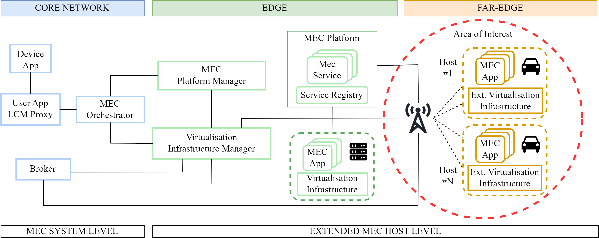
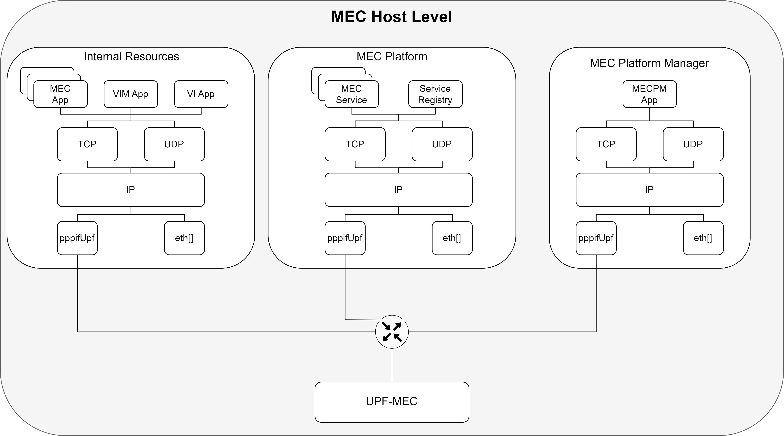
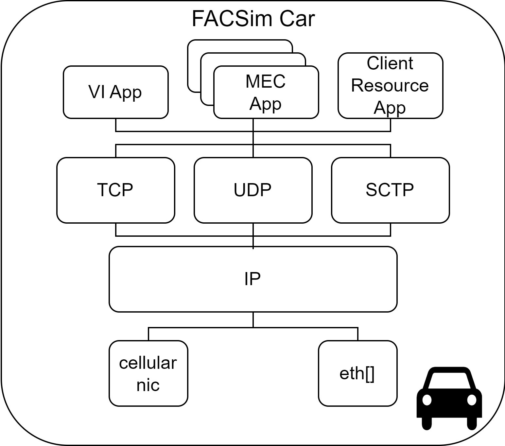
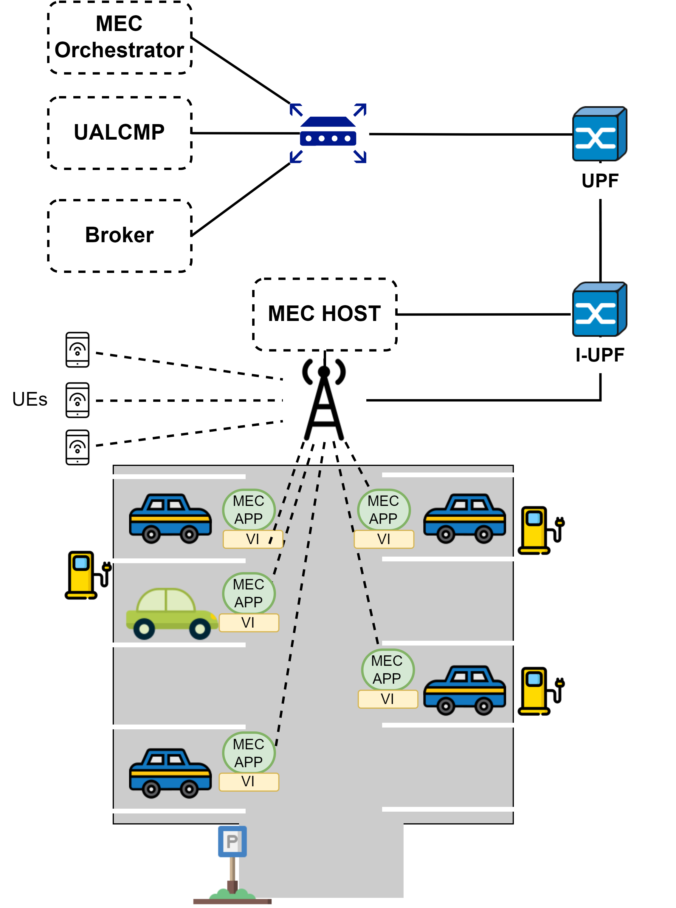

# FAr-edge Cloud Simulator: simulating edge applications deployment on far-edge resources in beyond 5G networks

FACSim is an [Omnet++](https://omnetpp.org/) simulator modeling the distribution of edge applications on far-edge resources using ETSI MEC-compliant procedures.

The simualtor relies on the well-known 5G simulation model ([Simu5G](https://github.com/Unipisa/Simu5G)) to support edge applications deployment in beyond 5G networks.

As this project depends on Simu5G, its implementation is part of a [Simu5G fork](https://github.com/aferaudo/Simu5G/tree/feat/vim-extension).

## General Architecture
The idea behind FACSim is to leverage far-edge device computational power to form clouds of resources at the far-edge layer. To deal with challenges characterizing these environments, like device and network heterogeneity, the simulator extends the [ETSI MEC architecture](https://www.etsi.org/deliver/etsi_gs/MEC/001_099/003/03.01.01_60/gs_MEC003v030101p.pdf) to deploy standard MEC apps at the far-edge level.

The adoption of a well-known standard allows solving various challenges such as:
* **technology coexistence**

* **cloud integration** for delay-tolerant services: ETSI MEC supports the deployment of requested services on both Cloud and edge resources through orchestration methods

* **easy-to-access** services: services accessibility and positioning occur through standard procedure

* **app migration throught standard API**: devices leaving the resource pool can use [ETSI MEC API](https://www.etsi.org/deliver/etsi_gs/MEC/001_099/021/02.01.01_60/gs_MEC021v020101p.pdf) to trigger migration of MEC compliant application deployed on them.

As shown in figure 1, the simulation model extends the concept of MEC-Host by supporting the acquisition of dynamic resources provided by far-edge devices. In particular, each MEC Host defines an Area of Interest (AoI) within which far-edge nodes can decide whether to provide their onboard resources. In this context, devices entering the AoI choose to expose their resources based on some rewards proposed by the MEC Host regulating that area. FACSim deploys a publish-subscribe model, where a Broker handles the resource pooling of multiple MEC Hosts. It collects MEC-Host AoI subscriptions and manages notifications whenever new devices enter that area.

Once device resource registration reaches completion, the MEC Host selects the most suitable host based on the requested MEC App characteristics.

    
    <em>Figure 1 FACSim general Architecture</em>

## Implementation
As shown in Figure 1, FACSim acts at the MEC Host layer. It enables dynamic resource acquisition to enhance MEC Host computational power with resources provided by far-edge devices. The main ETSI MEC component to be affected is the Virtualization Infrastructure Manager (VIM), which is in charge of administering host resources. In FACSim scenarios, the VIM should be aware of the single contributions that each far-edge host brings in terms of capacity. Thus, during startup, it subscribes to the MEC Host AoI and waits for notifications for each device resources inside that area. 

In FACSim, each MEC component has been modeled as a simple module  [Inet Application](https://doc.omnetpp.org/inet/api-current/neddoc/inet.applications.contract.IApp.html), to allow their deployment on different kinds of devices (e.g., Standard host, UE) and locations in the 5G network. The same applies to components that help in resource registration.

    
    <em>Figure 2 FACSim MECHost level deployment example</em>

Figure 2 shows an example of MECHost layer connected to an internal UPF (UPF-MEC in the figure) as described in the ETSI white paper [*MEC in 5G networks*](https://www.etsi.org/images/files/ETSIWhitePapers/etsi_wp28_mec_in_5G_FINAL.pdf). The UPF-MEC is connected to a gNB defining the 5G Radio Access Network (RAN). 

Since MEC components are modeled as applications, their deployment might occur on different devices. For example, as shown in figure 2, we choose to deploy FACSim MECHost within three devices: one representing its internal resources, one for MEC Services registration and deployment and finally a device hosting the MEC Platform Manager. 

On the other side, FACSim requires 5G User Equipment (UEs), modeled by Simu5G, to demonstrate their interest in providing their onboard resources. To do that, the simulation model introduces a **car** module as an extension of 5G UE, as present-day cars hold enough computational power to execute edge-based applications.

     
    <em>Figure 3 FACSim Car Module</em>

Figure 3 illustrates the Car module provided by FACSim. It runs three kinds of applications. The first two represent ETSI MEC components, where the former is the Virtualization Infrastructure (VI) in charge of managing and virtualizing internal resources, while the latter represents applications compliant with the ETSI MEC Standard. The last application *Client Resource App* deals with reward discovery and resource provisioning.

In the current version of the simulation module, we expect that far-edge devices (i.e., cars) remain fixed in a location for a certain amount of time (i.e., parking lot). Additionally, although FACSim uses "car" as a far-edge device module, it can be any abstraction of these devices as FACSim modules, VI and MEC App, can run on any device delivered with a complete software stack. 

Finally, to notify MEC Host about new resource approaching the AoI and to allow reward discovery far-edge side, the FACSim framework provides a module named *ResourceRegisterApp* acting as a Broker between the two sides.

     
    <em>Figure 4 FACSim Simulation Scenario</em>

In figure 4, we illustrated an example of a FACSim scenario, where UEs request MEC Apps execution and MEC APP deployment occurs on the FACSim Car module inside a parking lot.

It is worth noting that the [Simu5G](https://github.com/Unipisa/Simu5G)  framework already implements ETSI MEC standard components. Thus, some of them, like UALCMP and MEC App, were adapted to work within FACSim scenarios. 

## Simulator Features
* Decoupled model for resources subscription
* extension of ETSI MEC components to support deployment of MEC app on static far-edge nodes (cars)
* Application Mobility Service APIs extended to support migration among far-edge hosts
 

## Known Limitations
The simulator currently does not support the following:
* algorithm for resource scheduling - so far only Round Robin and Best First are supported
* emulation
* computational time simulation
* mobile nodes (e.g. SUMO and VEINS)
* energy consumption metric for resource allocation

## Future goals
* Enabling emulation of far-edge nodes
* Including mobile far-edge nodes for MEC app deployment
* Adding additional metrics in far-edge resource selection
* Implementing a case-study tailored to this kind of scenario
* Add How-to in this repo
* multi-access far-edge devices

## Contributors
* [Angelo Feraudo](mailto:angelo.feraudo@unibo.it)
* [Alessandro Calvio](mailto:alessandro.calvio@unibo.it)